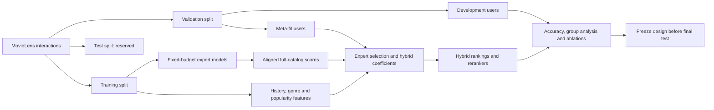

# Research direction: when should a hybrid trust each expert?

This is an empirical course-project contribution, not a claim to have invented
mixture-of-experts recommendation. The objective is to explain when additional
complexity earns its cost and when a simple model remains the better choice.

## Questions and falsifiable hypotheses

1. Does user/item context improve regression-weighted fusion beyond fixed weights?
   Reject the improvement hypothesis if gains are inconsistent across splits or
   paired differences are compatible with no improvement. Include the cost and
   interpretability of the extra parameters.
2. Does a method improve aggregate accuracy while harming particular users?
   Report improvement/harm fractions, training-activity groups, worst-group nDCG,
   head/tail recall and paired comparisons rather than a single leaderboard.
3. How much exposure fairness is impossible because candidates are missing?
   Measure a label-free feasibility bound for each candidate pool, then compare
   fixed and adaptively expanded pools. Do not equate catalog parity with the
   uniquely correct fairness objective.
4. Can user-group utility budgets reduce disproportionate losses from reranking?
   Fit strength choices on the meta-fit cohort, then audit each group's retention
   on development users. The constraint is a training objective, not a guarantee.
5. Does reranking each expert before fusion differ from reranking the fusion?
   Retain full support in both orderings. Reranked top-k are promoted; the rest of
   each original expert ranking remains in order before reciprocal-rank fusion.

## Context-conditioned score model

For each user u and item i, normalize each expert's eligible-item scores to
z_j(u,i). Training-derived h_u is standardized log history length, H_u is
standardized genre entropy, and p_i is standardized log item frequency.

The contextual ridge model predicts

    b + sum_j [w_j + a_j*h_u + e_j*H_u + c_j*p_i] * z_j(u,i)
      + d * std_j(z_j(u,i))

The last feature measures score disagreement; it is not a calibrated uncertainty
estimate. Effective expert weights vary with user and item context. They can be
negative and need not sum to one: this is unconstrained regression, not a
probabilistic gating network. Coefficients explain associations, not causation.
The prediction is a ranking score, not a calibrated click probability.

Fit mean squared error plus lambda times squared coefficient norm, leaving the
intercept unpenalized. Each meta-fit user's held-out positives have target 1;
sample up to five unobserved candidate items per positive with target 0. These
assumed negatives may include future positives. Use the exact same observations
for every feature ablation and regularization setting. Pointwise and pairwise regression are compared as a controlled loss ablation.

Ablations: fixed weights; user features only; item-popularity interactions only;
disagreement only; all contextual features. Static and full-context models also
use a pairwise least-squares objective: regress positive-minus-negative feature
differences onto a margin of one, with L2 regularization. Its intercept cancels.
This tests whether the loss, rather than architecture alone, explains differences. Compare against standalone
EASE, ItemKNN, BPR, exact popularity, independent Random, reciprocal-rank fusion,
and a training-activity-group switching hybrid. Random is a reference baseline,
not an expert in the fused models.

## Evaluation protocol

`experiment.py --tune-experts` tests a predeclared grid: EASE regularization
50/250/1000, ItemKNN neighbors 50/100/200, BPR dimension/budget pairs
(32,20), (64,60), (128,100). BPR changes dimension and budget together, so this
is a configuration comparison, not an isolated causal embedding-size ablation.
Experts train with fixed budgets, without validation-driven early stopping.
Expert variants are selected by meta-fit-cohort nDCG only; development users
are not consulted for that selection. Each seed uses a separate per-user 80/10/10 split of MovieLens.
We partition the validation users deterministically into two disjoint cohorts:
471 users fit regression coefficients and group policies; 472 users select and
compare model/regularization/reranker choices. Expert training still uses all
users' training interactions. This is not a user cold-start experiment.

This is a development protocol: hyperparameter selection and comparisons share
the development cohort, so the selected estimates are optimistic. The test set
is not read by `study.py`. After freezing the final design, add a frozen-model
inference path for test scoring rather than fitting the hybrid again on test.
The earlier `study-2026` smoke study reused experts with validation early stopping;
it is a preliminary diagnostic, not the primary multi-seed result.

Seeds 2026, 2027 and 2028 are a small robustness check. They overlap in underlying
users and interactions; they are not three independent datasets. Paired bootstrap
intervals resample users within one selected development split. They are
conditional/descriptive and do not correct for model selection or multiple tests.
A chronological split sensitivity study is still required before real-world
claims: random interaction splits ignore global time and exposure policy.

## Candidate feasibility and selective expansion

Define head items as the most frequent ceil(20% of catalog size) items, using
training counts only. Catalog-proportional exposure is an explicit diagnostic
objective. For list size k and T tail items available in the candidate pool,

    minimum possible head fraction >= max(0, k-T) / k.

A reranker cannot overcome this bound by changing its weights. The adaptive
variant expands the score-ranked candidate prefix only until it contains enough
tail items for the rounded catalog-proportional quota, with minimum pool 100.
Compare mean/median/max pool size, attainable exposure and accuracy against
fixed pools and full-catalog reranking. This is computational thrift in the
reranking stage; full-catalog expert scoring still happened, so do not claim
end-to-end retrieval speedups from this experiment.

The greedy exposure reranker minimizes prefix head-share deviation, blended
with normalized relevance. Stronger exposure correction can lower relevance
substantially. Plot the frontier and explain this, rather than hiding bad points.

## Genre and fairness definitions

- Diversity: mean pairwise Jaccard distance among recommended item genre sets.
- Calibration: Jensen-Shannon divergence in bits between training-history genre
  distribution and the list distribution. Multi-genre items contribute fractional
  mass. This is a JSD variant, not an exact reproduction of Steck's KL method.
- Item-side diagnostic: head exposure, absolute gap to head catalog share,
  head/tail recall and catalog coverage. Exposure parity ignores differing demand.
- User-side diagnostic: training-activity terciles, worst-group nDCG and max-minus-
  min group nDCG. This studies utility distribution, not demographic fairness.
- Group utility budget: choose the exposure strength with least head exposure
  among strengths retaining >=95% of each group's base nDCG on meta-fit users.
  Meta-fit also trained the hybrid, so report development retention explicitly.

## Prior work and positioning

- [Su et al., Hybrid Collaborative Filtering Algorithms Using a Mixture of Experts](https://www.asc.ohio-state.edu/statistics/dmsl/Su_2007.pdf):
  combining recommendation experts substantially predates this project. Our
  proposed contribution is a transparent contextual fusion study, not that idea.
- [A Critical Study on Data Leakage in Recommender System Offline Evaluation](https://arxiv.org/abs/2010.11060):
  global timeline violations can undermine offline evaluation. Our random split
  matches the course setup but needs a temporal sensitivity check for realism.
- [Calibration-Disentangled Learning and Relevance-Prioritized Reranking for Calibrated Sequential Recommendation](https://cseweb.ucsd.edu/~jmcauley/pdfs/cikm24b.pdf):
  calibration/relevance trade-offs and position-aware reranking have existing
  research. Our JSD reranker is an explicitly simplified baseline, not this model.

Do not describe an architecture as novel without a broader literature review.
A negative result with carefully controlled explanations is valid research.

## Pipeline at a glance

