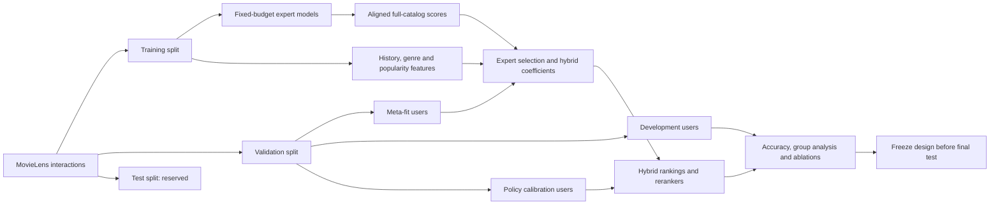

# Research questions: what does the observed feedback support?

This is an empirical course-project contribution, not a claim to have invented
mixture-of-experts recommendation. The objective is to explain when additional
complexity earns its cost and when a simple model remains the better choice.

## Questions and falsifiable hypotheses

1. Does user/item context improve regression-weighted fusion beyond fixed weights?
   Reject the improvement hypothesis if gains are inconsistent across splits or
   paired differences are compatible with no improvement. Include the cost and
   interpretability of the extra parameters.
2. Does a method improve aggregate accuracy while harming particular users?
   Report improvement/harm fractions, training-activity groups, worst-group nDCG,
   head/tail recall and paired comparisons rather than a single leaderboard.
3. How much exposure fairness is impossible because candidates are missing?
   Measure a label-free feasibility bound for each candidate pool, then compare
   fixed and adaptively expanded pools. Do not equate catalog parity with the
   uniquely correct fairness objective.
4. Can user-group utility budgets reduce disproportionate losses from reranking?
   Fit strength choices on a separate calibration cohort with paired uncertainty
   bounds, then audit each group's retention. The bound is approximate, not a
   real-world fairness or held-out retention guarantee.
5. Does reranking each expert before fusion differ from reranking the fusion?
   Retain full support in both orderings. Reranked top-k are promoted; the rest of
   each original expert ranking remains in order before reciprocal-rank fusion.
6. Do matched liked/disliked item contrasts convey more than knowing the likes
   and dislikes separately? Match information access across controls; remove
   orientation, randomize disliked partners, and preserve positive anchors.
   Evaluate all observed interactions and explicit liked ratings separately.
   A failed contrast model remains evidence against that implementation.
7. Does revising the interpretation and routing of categorical evidence within
   a prediction improve on keeping its initial interpretation fixed? Compare
   the same independently trained field architecture under equal initialization,
   episodes and budgets. Changing internal states alone does not answer this.
8. What changes when a model predicts how a recorded item was rated versus
   predicting the item and rating jointly? Preserve the same five-logit output
   and architecture. Compare the corresponding likelihoods and ranking readouts
   with locked strong references, without confusing the two targets.

## Context-conditioned score model

For each user u and item i, normalize each expert's eligible-item scores to
z_j(u,i). Training-derived h_u is standardized log history length, H_u is
standardized genre entropy, and p_i is standardized log item frequency.

The contextual ridge model predicts

    b + sum_j [w_j + a_j*h_u + e_j*H_u + c_j*p_i] * z_j(u,i)
      + d * std_j(z_j(u,i))

The last feature measures score disagreement; it is not a calibrated uncertainty
estimate. Effective expert weights vary with user and item context. They can be
negative and need not sum to one: this is unconstrained regression, not a
probabilistic gating network. Coefficients explain associations, not causation.
The prediction is a ranking score, not a calibrated click probability.

The lecture's weighted hybrid additionally requires sum_j w_j = 1. The
`constrained-ridge` family solves that equality-constrained regression exactly
with an unpenalized intercept. Negative weights are allowed; the lecture does
not establish nonnegativity. The unconstrained contextual families are explicit
extensions, not substitutes for this required baseline.

A meta-fit-only scale audit found that forcing sum-one raw z-score coefficients
while fitting binary targets creates a variance mismatch. The response-aligned
`calibrated-ridge` control first fits nonnegative-slope univariate affine mappings
on exactly the same meta-fit observations, then fits sum-one weights on those
mapped scores. Both affine mappings and fusion weights are saved. They are not
calibrated probabilities: negatives are sampled and affine outputs are unbounded.
The unaligned constrained control is retained. An unconstrained linear ranking
with positive coefficient sum can itself be divided by that sum without changing
its order. Thus this is a fitting-scale issue, not an intrinsic expressiveness
failure of sum-one ranking. See `evidence/model-audits/score-scale.json`.

Fit mean squared error plus lambda times squared coefficient norm, leaving the
intercept unpenalized. Each meta-fit user's held-out positives have target 1;
sample up to five unobserved candidate items per positive with target 0. These
assumed negatives may include future positives. Use the exact same observations
for every feature ablation and regularization setting. Pointwise and pairwise regression are compared as a controlled loss ablation.

Ablations: fixed weights; user features only; item-popularity interactions only;
disagreement only; all contextual features. Static and full-context models also
use a pairwise least-squares objective: regress positive-minus-negative feature
differences onto a margin of one, with L2 regularization. Its intercept cancels.
This tests whether the loss, rather than architecture alone, explains differences. Compare against standalone
EASE, ItemKNN, UserKNN, BPR, SLIMElastic, corrected FISM, genre content,
LightGCN, NGCF, NeuMF, exact popularity, independent Random, reciprocal-rank fusion,
and a training-activity-group switching hybrid. Random is a reference baseline,
not an expert in the fused models.

## Evaluation protocol

`experiment.py --tune-experts` tests a predeclared grid: EASE regularization
50/250/1000, ItemKNN neighbors 50/100/200, BPR dimension/budget pairs
(32,20), (64,60), (128,100). BPR changes dimension and budget together, so this
is a configuration comparison, not an isolated causal embedding-size ablation.
Experts train with fixed budgets, without validation-driven early stopping.
Expert variants are selected by meta-fit-cohort nDCG only; development users
are not consulted for that selection. Each seed uses a separate per-user 80/10/10 split of MovieLens.
The current protocol divides validation users into three disjoint cohorts:
471 users select experts and fit regression coefficients; 236 users select and
compare hybrid settings; 236 users fit the group policy independently of those
two operations. Expert training still uses all
users' training interactions. This is not a user cold-start experiment.

This is a development protocol: hyperparameter selection and comparisons share
the development cohort, so the selected estimates are optimistic. The test set
is not read by `study.py`. `freeze.py` saves parameters, transforms, source
hashes and full-catalog train-fitted scores, verifies exact validation replay,
and seals the comparison set before `final_evaluate.py` opens test labels.
Test candidates exclude training and validation histories. Expert score
normalizers remain those fitted on validation-eligible catalogs; no test
renormalization or model refitting occurs.
The earlier `study-2026` smoke study reused experts with validation early stopping;
it is a preliminary diagnostic, not the primary multi-seed result.
The historical `research-v2` study used 471/472 users and reused meta-fit labels
for its group policy. Its artifacts are retained, not silently relabelled as
independently calibrated. The new calibration users have appeared in earlier
exploratory development reports; code-level separation does not make the entire
research history a preregistered trial.

Seeds 2026, 2027 and 2028 are a small robustness check. They overlap in underlying
users and interactions; they are not three independent datasets. Paired bootstrap
intervals resample users within one selected development split. They are
conditional/descriptive and do not correct for model selection or multiple tests.
The chronological sensitivity study in `evidence/temporal-v1` repeats matched
expert grids under per-user time ordering and finds materially different scores.
It still cannot support real-world claims: cross-user global time and exposure
policy are not controlled, and rating-entry timestamps need not be watching times.

## Candidate feasibility and selective expansion

Define head items as the most frequent ceil(20% of catalog size) items, using
training counts only. Catalog-proportional exposure is an explicit diagnostic
objective. For list size k and T tail items available in the candidate pool,

    max(0, k-T) <= number of selected head items <= min(k, H),

where H is the available head count. The older analysis checked only the lower
bound; the current implementation checks both limits.

A reranker cannot overcome this bound by changing its weights. The adaptive
variant expands the score-ranked candidate prefix only until it contains enough
head and tail items for the rounded catalog-proportional quota, with minimum pool 100.
Compare mean/median/max pool size, attainable exposure and accuracy against
fixed pools and full-catalog reranking. This is computational thrift in the
reranking stage; full-catalog expert scoring still happened, so do not claim
end-to-end retrieval speedups from this experiment.

The greedy exposure reranker minimizes prefix head-share deviation, blended
with normalized relevance. Stronger exposure correction can lower relevance
substantially. Plot the frontier and explain this, rather than hiding bad points.

## Genre and fairness definitions

- Diversity: mean pairwise Jaccard distance among recommended item genre sets.
- Calibration: Jensen-Shannon divergence in bits between training-history genre
  distribution and the list distribution. Multi-genre items contribute fractional
  mass. This is a JSD variant, not an exact reproduction of Steck's KL method.
- Item-side diagnostic: head exposure, absolute gap to head catalog share,
  head/tail recall and catalog coverage; rank-discounted exposure per item in
  each group; whole-catalog Gini and entropy, including unexposed items.
  Exposure parity ignores differing demand.
- User-side diagnostic: training-activity terciles, worst-group nDCG and max-minus-
  min group nDCG. This studies utility distribution, not demographic fairness.
- User popularity calibration: JSD between each user's training-history
  head/tail distribution and their list, distinct from imposing the same
  catalog distribution on every user. Its reranker is evaluated alongside genre
  calibration, diversity and exposure.
- Group utility budget: choose the exposure strength with least parity error
  among strengths whose Bonferroni-adjusted paired bootstrap lower bound on
  E[nDCG_option - .95*nDCG_base] is nonnegative on calibration users. Baseline
  fallback applies to unsupported or small groups. Bounds are approximate,
  users share training data, and retention on final evaluation must be shown.
- Taste groups use only training ratings: activity, liked-genre entropy and an
  explicit genre-contradiction proxy with an insufficient-evidence category.
  These are operational proxies, not measures of personality or emotion.

## Contrast-transfer experiments

`exception_model.py` and `exception_experiment.py` test the intuition that a
liked item close to a disliked item can reveal a specific preference boundary.
Ratings >=4 are likes, <=2 dislikes, and 3 neutral. Candidate masking includes
every training interaction regardless of rating. Training-only item geometry
combines signed-interaction SVD with genres. Similar liked/disliked items form
oriented contrasts; random Fourier features compare their distributions across
users before a shared neighbor decoder transfers signed feedback.

Controls retain the same feedback access and decoder: positive-only neighbors,
signed neighbors, signed geometry without pairing, unordered matched pairs,
anchor-only geometry, first-moment contrasts and randomized disliked partners.
This is a matched contrast representation, not verified human exceptions.

The first implementation is substantially worse than signed neighbors and EASE
on all three development splits; randomized partners behave similarly. The
second, explicitly exploratory revision preserves the liked anchor and gates
candidate similarity by its contrast with a matched disliked item. Its fixed
temperature grid and randomized-partner control are written before fitting.
Positive-only EASE, signed EASE and a separate like/dislike-channel linear model
test whether any gain comes merely from using rating polarity. No ensemble or
research-priority claim follows from introducing a custom model.

All-observed ranking and rating>=4 ranking answer different questions. Known
dislike hits count only held-out items actually rated <=2; missing ratings are
unknown, so this rate is not total dissatisfaction or an online harm measure.
Selection occurs separately per objective on meta-fit users. Revisions respond
to development evidence; those results remain exploratory.

## Evidence meaning and the independent field

The first contrast studies impose an interpretation of a low rating: a signed
dislike and possibly a boundary around similar items. A follow-up information
audit tests that interpretation with controls preserving user/item dislike
counts. It does not find a stable predictive advantage for the particular
dislike placements under its declared comparison. See
[the information-control protocol](NEGATIVE_INFORMATION_PROTOCOL.md) and
[its results](evidence/negative-information-v2/RESULTS.md).

The separate [categorical field](ADAPTIVE_RESEARCH.md) keeps all five observed
categories and learns their interactions with item identity. Recurrent routing
and source weights can change as the supplied history is processed. Candidate
predictions cannot turn into new evidence. Fixed-flow and hard-clamp controls
test the proposed mechanism, with their joint interventions explicitly noted.
This is a standalone learned model rather than an ensemble of the course experts.

Rating completion conditions on an item already having a record. That objective
does not identify the relative propensity of different items to appear in a
history. The [joint experiment](JOINT_FIELD_PROTOCOL.md) trains those relative
item masses through the same five output logits. Its likelihood concerns the
recording process in this dataset; it does not recover exposure or satisfaction
for unobserved items. The [bounded training follow-up](JOINT_FIELD_CONVERGENCE_PROTOCOL.md)
keeps the original 100-epoch results and independently reproduces their training
trajectory before continuing to a fixed 400-epoch cap.

All final choices and comparison families are recorded in
[the evaluation decisions](evidence/EVALUATION_PROTOCOL.md). Dynamic computation,
an improved training loss, or beating a weak count baseline is insufficient to
establish an improvement over strong recommenders.

## Prior work and positioning

- [Su et al., Hybrid Collaborative Filtering Algorithms Using a Mixture of Experts](https://www.asc.ohio-state.edu/statistics/dmsl/Su_2007.pdf):
  combining recommendation experts substantially predates this project. Our
  proposed contribution is a transparent contextual fusion study, not that idea.
- [A Critical Study on Data Leakage in Recommender System Offline Evaluation](https://arxiv.org/abs/2010.11060):
  global timeline violations can undermine offline evaluation. Our random split
  matches the course setup but needs a temporal sensitivity check for realism.
- [Calibration-Disentangled Learning and Relevance-Prioritized Reranking for Calibrated Sequential Recommendation](https://cseweb.ucsd.edu/~jmcauley/pdfs/cikm24b.pdf):
  calibration/relevance trade-offs and position-aware reranking have existing
  research. Our JSD reranker is an explicitly simplified baseline, not this model.

Do not describe an architecture as novel without a broader literature review.
A negative result with carefully controlled explanations is valid research.

## Pipeline at a glance

