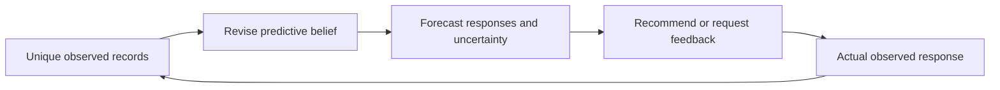

# A recommender that learns how to revise its expectations

Conceptual design, 29 September 2026. This is a proposed model and a research
question, not an implemented or evaluated result. The running study and completed
coursework are unchanged. The user asked for a coherent model that is "alive",
without making another existing recommender the organizing principle.

## Governing idea

The model maintains revisable expectations about observable responses. An
interaction can change what it expects, how certain it is, and which previous
observations matter for the next prediction.

Learn **how evidence should change a prediction**. A useful state preserves the
distinctions between histories that matter for future predictions. The update
rule earns its value by improving predictions made after feedback arrives.

This gives one loop:



The historical dataset supports observation and prediction. Demonstrating the
action-to-feedback part of this loop requires an interactive experiment with
logged actions and actual responses.

## What each layer is responsible for

| Layer | Meaning | Design consequence |
|---|---|---|
| Observations | Facts the system actually received | Preserve item identity, rating, submission time and any genuinely observed context. Store unknown exposure as unknown. A missing rating is not a rejection. |
| Item representation | A learned address for an item and the response distinctions it supports | Keep trainable identity information and available item attributes. Learn representations with the predictive model; do not force distinct movies into one anonymous structural pattern. |
| Evidence memory | The records behind the current belief | Keep unique episodes with provenance. Compression is a computational convenience; earlier records remain available to correct a poor approximation. |
| Predictive state | Current expectations plus uncertainty under the model | Maintain a compact probabilistic state. Separate predicted rating variability from uncertainty about the state; measure whether either is calibrated. |
| Revision | How this observation changes those expectations | One learned inference rule combines the previous belief, item representation and observed response. Consistent evidence may mainly increase confidence; contradictory evidence may change expectations, uncertainty, or both. |
| Prediction | Observable responses conditioned on current evidence | Use one shared generative predictor, with a recorded-item component and an ordinal-rating component. They represent different observations, not separate experts whose scores are blended. |
| Decision | Which available action serves the declared user objective | Rank with the appropriate output. In an interactive extension, an explicit feedback question can help resolve an ambiguity. The offline prototype does not claim to learn a causal exploration policy. |
| Learning | Which revisions improve later predictions | Train representations, prediction and approximate state updates together on permitted history prefixes and subsequent observations. Merely reconstructing the latest input is insufficient. |

The distinction between recorded-item and rating predictions matters. A person
can record a low rating. Predicting that recording is a different question from
predicting a high rating. Neither alone estimates satisfaction caused by showing
an item when exposure is unobserved.

## One probabilistic model, with a learned update

Let `H_t` be the unique observations available by a prediction cutoff, `q_t` the
approximate belief over predictive state, and `B_next` a future recorded bundle.

The model provides a normalized observation distribution `p_theta(B_next | z)`
and a state transition/prior. A learned update `U_phi` approximates conditioning
that belief on a newly observed bundle. Train this inference rule and the
observation model together using sequential predictive likelihood and its
explicit variational approximation. This is an architectural proposal; no exact
Bayesian inference or calibration guarantee is claimed.

The Bayesian target for a single update has the form:

```
new belief = argmin_q [
    expected negative log likelihood of the newly observed bundle
    + KL(q || predicted prior belief)
]
```

Within this model, that objective expresses how much revision the evidence
supports. It does not impose a separate hand-written surprise threshold. Future
prediction loss tests whether the learned approximation makes useful revisions.
Its uncertainty is conditional on model assumptions, not an all-purpose measure
of ignorance.

This single-step expression is not automatically an evidence lower bound for
the whole sequence, especially when the predicted prior is already approximate.
The executable protocol must derive its sequence objective and inference
approximation explicitly. Adding a future-prediction loss does not, by itself,
make an arbitrary combined loss a joint-model likelihood or ELBO.

Stable and changing behavior should be representable in the transition model.
Begin with a small shared dynamics family and learn its parameters from the
training prefix. A hard recent-history cutoff, a separate reset detector,
multiple specialist scorers and a special trust network are not required by
this principle. Add such mechanisms only if a specific failure warrants them.
The first prototype can use event/bundle order; elapsed-clock dynamics require
an additional, justified model of what elapsed time means.

During assessment, the shared item representations, predictor and update rule
remain frozen. The personal belief and evidence memory update after each revealed
bundle. This is actual feedback adaptation without selecting new hyperparameters
on future outcomes. Updating global representations online would also require
versioned state transport or replay, and is outside this first prototype.

## Memory has a precise role

An exact sufficient belief would make raw-history retrieval statistically
redundant. Our approximate state may lose useful distinctions. Evidence replay
is therefore a way to repair an approximation, not a new independent observation.

Every record has a unique identity. Replaying a prefix starts from the appropriate
prior and accounts for each record once. It must not multiply an old record's
likelihood into a posterior that already counted it. The initial prototype keeps
the full permitted history and supports full-prefix replay; selective retrieval
is a later efficiency question, rather than another arbitrary neighbor cap.

Repeatedly confirmed expectations should become harder to change without
supporting evidence. An isolated contradiction and sustained contradictory
feedback must remain distinguishable possibilities. The data may not identify
whether the cause is context, noise, changing preferences or recording behavior.
The system must express that ambiguity instead of inventing a psychological label.

## Concrete behaviors that would make this worthwhile

1. An expected response can increase confidence without unnecessarily moving the
   recommendation list.
2. A conflicting response can revise relevant predictions without automatically
   erasing everything learned about the person.
3. Sustained new evidence can overcome an old belief; robustness must not become
   permanent resistance to change.
4. Earlier evidence can become useful again when a similar predictive situation
   returns. Retaining facts allows this without declaring a fixed preference
   category or hand-written mood.
5. Duplicate delivery and rereading do not fabricate evidence or confidence.

These are behaviors to measure, not properties guaranteed by giving components
names such as memory, uncertainty or reasoning.

## How this can be tested with the assignment data

The existing project already covers the mandatory model/hybrid, independent
metric, group-analysis and societal tasks. This new study belongs in an
exploratory appendix about adaptation and insightful analysis, rather than
replacing those deliverables. See the existing [coverage map](../../coursework_completion/COVERAGE.md).

MovieLens timestamps identify rating submissions, potentially long after
consumption. Predict later **recorded bundles**, not an asserted sequence of
viewing experiences. Equal timestamps must not be converted into invented
within-bundle order. All records at a global timestamp are scored before any of
them update shared state. Item statistics, training parameters and episode
memory must obey the same global past-only boundary.

The next target's timestamp, gap, item identity and rating are not inputs to its
forecast. If a conditional-rating task supplies a target item's identity, label
that as a different task from predicting which item will be recorded next.
Catalog eligibility must be declared; the available catalog does not establish
historical movie exposure or availability.

First check the update mechanics on controlled streams: stationary responses,
isolated corruptions, sustained changes, and return to an earlier regime. Then
test the real sequence with predict-before-reveal evaluation. Measure later
predictive loss, ranking, ordinal-rating calibration, adaptation delay, retained
accuracy, update latency and memory together.

Use the same model with state updates disabled to isolate the value of revision.
Also use a version receiving the same accumulated records without temporal order,
so an improvement cannot be explained only by getting more feedback. This is an
internal mechanism test, not a new external leaderboard comparison. Any online
claim about useful recommendations or informative questions needs actual logged
actions and feedback; a simulator demonstrates behavior only under its assumptions.

This dataset was already explored. A chronological rearrangement does not create
fresh scientific confirmation. No new outcomes were read to write this design.

## Research claim and prior art

Predictive state, Bayesian updating and dynamic collaborative filtering already
exist. Their names do not supply a novelty claim. The specific research question
is whether a jointly learned revision rule, supported by replayable evidence,
adapts reliably while preserving previous useful predictions. The scientific
contribution would require specifying that rule, showing its mechanism, and
demonstrating the claimed behavior under the controls above.

The earlier [research design](../../exploratory/DESIGN.md) already proposed
revisable explanations. The substantive change here must be learning and testing
updates across newly revealed observations. Iterating a computation over an
unchanged history would not establish that capability.

Primary sources checked for the conceptual boundary:

- [Littman, Sutton and Singh, Predictive Representations of State](https://proceedings.neurips.cc/paper/2001/file/1e4d36177d71bbb3558e43af9577d70e-Paper.pdf): motivates state in terms of future observable predictions. Our proposed approximate belief representation is not claimed to satisfy their linear-PSR results.
- [Sun, Parthasarathy and Varshney, Collaborative Kalman Filtering](https://research.ibm.com/publications/collaborative-kalman-filtering-for-dynamic-matrix-factorization): establishes that state-space collaborative filtering and changing latent preferences are prior art.
- [Adams and MacKay, Bayesian Online Changepoint Detection](https://arxiv.org/abs/0710.3742): an example of explicit assumptions needed to model abrupt changes; it is not an extra module in the first design.
- [Harper and Konstan, The MovieLens Datasets: History and Context](https://files.grouplens.org/papers/harper-tiis2015.pdf), p. 15: documents the rating-time versus consumption-time distinction.

## Next concrete artifact

Build a small, inspectable interaction loop with three exposed operations:
`predict`, `observe`, and `replay`. Show a forecast before feedback, the resulting
state revision, and the subsequent forecast. The demonstration should display
both response probabilities and uncertainty, with the supporting observations
traceable locally. It should pass the duplicate/replay and controlled-change
checks before a large training sweep is justified. Precise distribution families,
parameter budgets and the evaluation split must be fixed in a separate executable
protocol before fitting real data; this document intentionally makes no claim
that those implementation decisions have already been validated.
