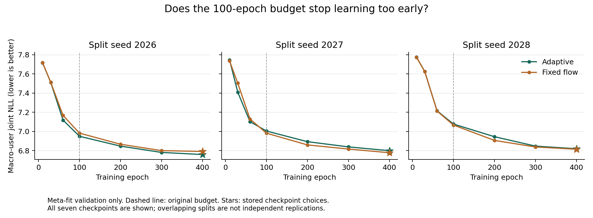

# Joint-field optimization-budget sensitivity

The figures show all seven predeclared checkpoints for both variants and all three splits. Stars mark the checkpoint already selected by the runner. These are validation selection losses, not held-out ranking scores or evidence of convergence at the final budget.
