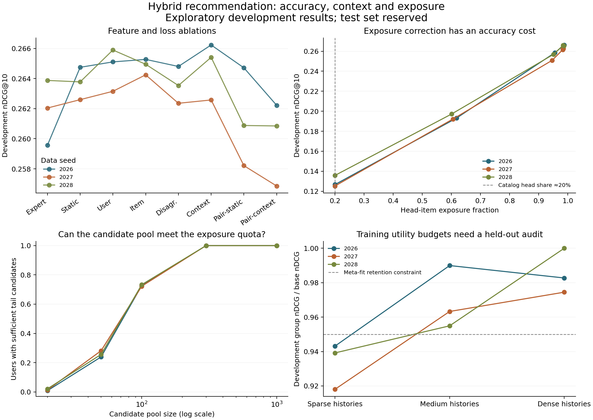

# Research checkpoint: development evidence

Three overlapping MovieLens 100K data splits; 471 meta-fit users and 472 development users per split. Expert variants were selected on meta-fit users. Hybrid variants were selected on development users. The table therefore reports selected development performance, not unbiased test accuracy.

## Architecture and ablations

The contextual model learns expert score weights that depend on training-history size, genre entropy and item popularity, with an additional disagreement feature. Static weights, isolated feature groups and pairwise score-margin regression provide controls. These techniques have prior art; the contribution is the implementation, controlled comparison and analysis.

| Family | 2026 | 2027 | 2028 | Mean nDCG@10 |
|---|---:|---:|---:|---:|
| expert | 0.2596 | 0.2620 | 0.2639 | 0.2618 |
| static | 0.2647 | 0.2626 | 0.2638 | 0.2637 |
| user | 0.2651 | 0.2632 | 0.2659 | 0.2647 |
| item | 0.2653 | 0.2642 | 0.2650 | 0.2648 |
| disagreement | 0.2648 | 0.2624 | 0.2635 | 0.2636 |
| context | 0.2662 | 0.2626 | 0.2654 | 0.2647 |
| static-pairwise | 0.2647 | 0.2582 | 0.2609 | 0.2613 |
| context-pairwise | 0.2622 | 0.2569 | 0.2609 | 0.2600 |

The highest mean selected development score is **item** (0.2648). The full contextual ridge differs from the selected expert by **+0.0029 nDCG** on average. The additional architecture does not earn a performance claim merely by being more elaborate. See paired-comparisons files for descriptive intervals and fractions of users helped/harmed.

## Candidate feasibility

For a length-k list with only T tail items in its candidate pool, the head fraction cannot be below max(0,k−T)/k. No reranking weight can overcome missing candidates. Selective expansion uses the shortest score prefix that contains the required tail quota, with minimum pool 100; full support remains available upstream.

| Seed | Mean expanded pool | Users expanded | Same top-k as full-pool exposure reranking |
|---|---:|---:|---:|
| 2026 | 110.7 | 27.3% | 100.0% |
| 2027 | 109.5 | 27.8% | 100.0% |
| 2028 | 109.5 | 26.7% | 100.0% |

This comparison uses exposure strength 1 and an explicit catalog-parity objective. It measures reranking candidate work, not total retrieval latency: expert full-catalog scores were already computed. Exact agreement here is not a claim about all rerankers or unseen datasets.

## Fairness and accuracy

Head means the most popular 20% of items by training count. Catalog-proportional exposure is a diagnostic choice, not an assertion that equal item exposure is always fair. Strong correction can raise tail recall while lowering nDCG; all settings, including poor ones, are retained in aggregates.json. Genre calibration uses JSD and diversity uses Jaccard distance.

The group-aware policy chooses an exposure strength that retains at least 95% of each activity group’s base nDCG on meta-fit users. The lower-right plot audits this on development users. A training constraint is not a held-out guarantee, and smaller utility gaps alone can hide degradation of every group. Both worst-group utility and absolute accuracy are reported.

## Evidence and remaining work

Source manifests, score/split hashes and coefficient/selection artifacts accompany this summary. Raw recommendations and user-level data remain in ignored local run directories. The three seeds overlap in users/data, and the bootstrap intervals do not correct for selection. These are development findings. Required next checks are an independent implementation review, clean environment reproduction, a chronological split sensitivity analysis, lecturer feedback on fairness definitions and scope, and a frozen final test evaluation. Do not submit this checkpoint as the final task-structured report.
