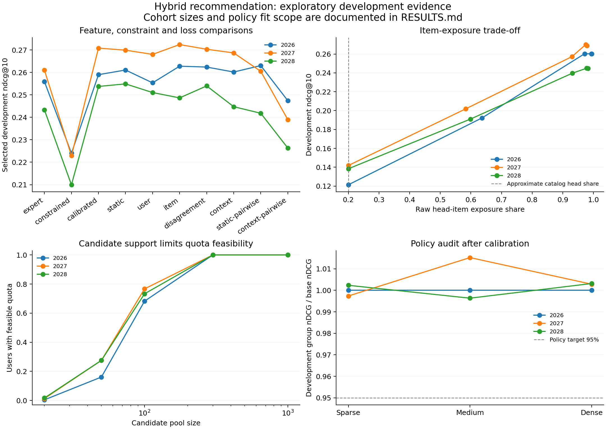
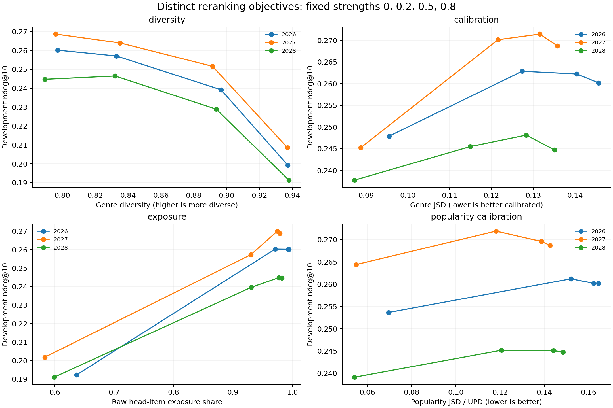

# Research checkpoint: development evidence

3 MovieLens 100K split(s), with cohort sizes verified against each study manifest. Expert settings and regression coefficients use meta-fit labels. Hybrid settings use development labels, so reported development comparisons are selected and exploratory, not unbiased test estimates.

| Seed | Meta-fit users | Development / model-selection users | Independent policy-calibration users |
|---|---:|---:|---:|
| 2026 | 471 | 236 | 236 |
| 2027 | 471 | 236 | 236 |
| 2028 | 471 | 236 | 236 |

These cohorts share the train-fitted recommenders; this is not user cold-start. Repeated split seeds share users and interactions and are not independent populations.

## Individual models

Each row is a source model passed into the hybrid study; model identities and settings come from source manifests. Values average available seeds, whose count is explicit. Rating-aware custom models may use richer signals than implicit baselines; their matched-information controls belong in the supplementary contrast study. No item-rating satisfaction claim follows from the main all-observed-interactions ranking protocol.

| Model | Seeds | nDCG@10 | Recall@10 | Diversity | Genre JSD | Popularity JSD | Exposure Gini |
|---|---:|---:|---:|---:|---:|---:|---:|
| BPR | 3 | 0.2204 | 0.2045 | 0.7949 | 0.1592 | 0.1192 | 0.9239 |
| ContrastTransfer:all_observed | 3 | 0.1396 | 0.1024 | 0.8037 | 0.1859 | 0.1665 | 0.9825 |
| EASE | 3 | 0.2499 | 0.2256 | 0.8090 | 0.1424 | 0.1556 | 0.9402 |
| ExactPop | 3 | 0.1232 | 0.1161 | 0.8310 | 0.1946 | 0.1666 | 0.9908 |
| FISMCorrected | 3 | 0.2220 | 0.2075 | 0.7965 | 0.1520 | 0.1003 | 0.9228 |
| GenreContent | 3 | 0.0244 | 0.0213 | 0.1552 | 0.2530 | 0.1620 | 0.9589 |
| ItemKNN | 3 | 0.2192 | 0.1989 | 0.8046 | 0.1557 | 0.1514 | 0.9423 |
| LightGCN | 3 | 0.2263 | 0.2070 | 0.7828 | 0.1582 | 0.1221 | 0.9233 |
| NGCF | 3 | 0.2231 | 0.2052 | 0.7982 | 0.1614 | 0.1521 | 0.9495 |
| NeuMF | 3 | 0.2104 | 0.1947 | 0.7871 | 0.1656 | 0.1131 | 0.9257 |
| PositiveEASE:all_observed | 3 | 0.2294 | 0.2041 | 0.7957 | 0.1514 | 0.1578 | 0.9481 |
| Random | 3 | 0.0071 | 0.0056 | 0.8169 | 0.2399 | 0.2747 | 0.4984 |
| SLIMElastic | 3 | 0.2502 | 0.2267 | 0.8142 | 0.1380 | 0.1308 | 0.9235 |
| SignedChannelsLinear:all_observed | 3 | 0.2312 | 0.2031 | 0.7973 | 0.1514 | 0.1586 | 0.9490 |
| UserKNN | 3 | 0.2264 | 0.2041 | 0.8095 | 0.1689 | 0.1642 | 0.9586 |

Exact selected settings, timings and group metrics are in `individual-models.json`. A dash means the historical run did not record that metric.

## Architecture and ablations

Static and contextual regression use the same expert-score inputs. Contextual weights depend on training history size, genre entropy and item popularity; the disagreement feature and squared pairwise margin loss have separate ablations. These techniques have prior art.

The lecture-aligned constrained ridge baseline enforces sum(weights)=1 with an unpenalized intercept. Nonnegativity is not imposed; this is an affine combination, not a convex mixture.

The calibrated constrained variant first fits a nonnegative-slope affine response transform for each expert on the same meta-fit observations, then fits sum-to-one ridge weights. This tests sensitivity to the scale imposed by z-scores and binary regression targets; the original constrained result is retained. The transformed scores need not be probabilities. The sum-to-one constraint applies before composing calibration with the final score; both calibration and effective coefficients are saved. This correction followed development inspection and remains exploratory.

| Family | 2026 | 2027 | 2028 | Mean nDCG@10 |
|---|---:|---:|---:|---:|
| expert | 0.2559 | 0.2610 | 0.2433 | 0.2534 |
| constrained | 0.2240 | 0.2229 | 0.2099 | 0.2189 |
| calibrated | 0.2590 | 0.2708 | 0.2538 | 0.2612 |
| static | 0.2611 | 0.2699 | 0.2549 | 0.2620 |
| user | 0.2554 | 0.2680 | 0.2510 | 0.2582 |
| item | 0.2628 | 0.2724 | 0.2487 | 0.2613 |
| disagreement | 0.2624 | 0.2703 | 0.2540 | 0.2622 |
| context | 0.2602 | 0.2687 | 0.2447 | 0.2579 |
| static-pairwise | 0.2631 | 0.2605 | 0.2418 | 0.2551 |
| context-pairwise | 0.2474 | 0.2390 | 0.2263 | 0.2376 |

The highest mean selected development score is **disagreement** (0.2622). Full contextual ridge differs from the selected individual expert by **+0.0044 nDCG**. This is a description of development results, not a generalization or significance claim. Paired-comparison intervals remain descriptive because this cohort selected the models.

## Candidate feasibility

With H head and T tail candidates, feasible head counts in a length-k list lie between max(0,k-T) and min(k,H). A target q is feasible exactly when it lies in that interval. Reranking cannot recover an item absent from its candidate set.

| Seed | Quota checks | Target head / tail | Mean pool | Users expanded | Same top-k as full pool |
|---|---|---:|---:|---:|---:|
| 2026 | head_and_tail | 2 / 8 | 110.4 | 31.8% | 100.0% |
| 2027 | head_and_tail | 2 / 8 | 107.3 | 23.3% | 100.0% |
| 2028 | head_and_tail | 2 / 8 | 110.6 | 26.7% | 100.0% |

New runs expand to the shortest prefix supporting both target counts, with minimum pool 100. Historical runs explicitly labelled tail-only did not check head support. The measured comparison uses exposure strength 1. Full-catalog expert scores are already computed, so pool size is reranking work, not a measured total latency speedup. Agreement is empirical.

## Reranking objectives and order

Genre calibration compares genre distributions. Popularity calibration is a user-side JSD/UPD objective matching each user's training head/tail distribution. Item exposure instead uses the catalog head/tail proportions as a chosen shared target. Exposure Gini and entropy include zero-exposure items and use logarithmic position discounts; raw head share does not.

| Contextual reranker (strength 0.5) | Seeds | nDCG@10 | Diversity | Genre JSD | Popularity JSD | Raw head share | Exposure Gini |
|---|---:|---:|---:|---:|---:|---:|---:|
| base | 3 | 0.2579 | 0.7942 | 0.1388 | 0.1518 | 0.9853 | 0.9395 |
| diversity | 3 | 0.2399 | 0.8939 | 0.1250 | 0.1398 | 0.9747 | 0.9381 |
| calibration | 3 | 0.2595 | 0.8038 | 0.1213 | 0.1522 | 0.9853 | 0.9385 |
| exposure | 3 | 0.2524 | 0.7901 | 0.1403 | 0.1056 | 0.9441 | 0.9273 |
| popularity_calibration | 3 | 0.2594 | 0.7921 | 0.1396 | 0.1302 | 0.9681 | 0.9365 |

| Order comparison at strength 0.5 | Seeds | Before RRF nDCG | After RRF nDCG | Before objective | After objective |
|---|---:|---:|---:|---:|---:|
| diversity (diversity) | 3 | 0.2576 | 0.2382 | 0.8282 | 0.8872 |
| calibration (calibration_jsd) | 3 | 0.2555 | 0.2529 | 0.1375 | 0.1283 |
| exposure (head_exposure) | 3 | 0.2520 | 0.2432 | 0.9835 | 0.9566 |
| popularity_calibration (popularity_jsd) | 3 | 0.2524 | 0.2524 | 0.1546 | 0.1450 |

Both orderings retain full ranking support. Before-fusion reranking promotes each expert's reranked top-k and appends remaining candidates before RRF. Each seed's individual and contextual reranker metrics, discounted item-group exposure and activity-group diagnostics remain in `aggregates.json`, including settings that perform poorly.

## Group policy audit

| Seed | Policy fit | Target retention | Sparse development | Medium development | Dense development |
|---|---|---:|---:|---:|---:|
| 2026 | independent calibration / bootstrap | 95.0% | 100.0% | 100.0% | 100.0% |
| 2027 | independent calibration / bootstrap | 95.0% | 99.7% | 101.5% | 100.3% |
| 2028 | independent calibration / bootstrap | 95.0% | 100.2% | 99.6% | 100.3% |

Independent calibration users are excluded from fitting and model selection. The new policy uses paired, approximately Bonferroni-adjusted bootstrap lower bounds to screen retention loss before minimizing exposure gap; small groups fall back to the baseline. This is not a distribution-free guarantee. Historical meta-fit reuse is labelled separately. Development selected the base model, so development retention is still a descriptive audit; reserved test is the final check. Report absolute and worst-group quality, since a smaller group gap can accompany harm to every group.

## Evidence and remaining work

Source manifests, score/split hashes, coefficient artifacts, cohort counts and model identities accompany this summary. Raw user histories and recommendation lists stay in ignored run directories. Clean-environment reproduction, temporal sensitivity and frozen held-out evaluation require their own evidence artifacts; their completion is not inferred from these development results. This evidence summary is not the task-formatted final report and does not establish novelty, emotional understanding, or a grade.
