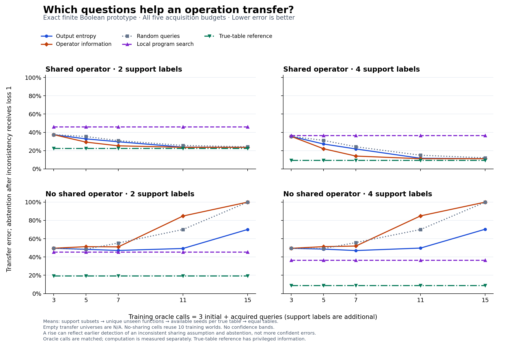

# Exact shared-operator query experiment

This is a completed finite Boolean experiment. It learns a four-bit operation
by exhaustive hypothesis selection in a supplied 18-program grammar. It does
not establish a new learning objective, general architecture or recommendation
result. The target-versus-nuisance information distinction is established in
[Sloman et al., UAI 2024](https://arxiv.org/abs/2310.14968).

[Standalone PDF figure](query-transfer.pdf)

## Every predeclared result

Values are transfer error, so lower is better. Negative focused-minus-entropy
values favor focused acquisition. The grid reports every budget and support size;
no favorable cell is selected as the result. Failed shared-model inference abstains
and receives loss **1**, including in the no-sharing regime.

| Regime | Support | Total oracle calls | Entropy | Focused | Random | Local | True table | Focused − entropy |
|---|---:|---:|---:|---:|---:|---:|---:|---:|
| shared | 2 | 3 | 0.3744 | 0.3744 | 0.3744 | 0.4597 | 0.2245 | 0.0000 |
| shared | 2 | 5 | 0.3283 | 0.2931 | 0.3542 | 0.4597 | 0.2245 | -0.0352 |
| shared | 2 | 7 | 0.2968 | 0.2525 | 0.3093 | 0.4597 | 0.2245 | -0.0444 |
| shared | 2 | 11 | 0.2381 | 0.2360 | 0.2563 | 0.4597 | 0.2245 | -0.0022 |
| shared | 2 | 15 | 0.2360 | 0.2360 | 0.2420 | 0.4597 | 0.2245 | 0.0000 |
| shared | 4 | 3 | 0.3555 | 0.3555 | 0.3555 | 0.3644 | 0.0951 | 0.0000 |
| shared | 4 | 5 | 0.2725 | 0.2207 | 0.3118 | 0.3644 | 0.0951 | -0.0519 |
| shared | 4 | 7 | 0.2182 | 0.1404 | 0.2422 | 0.3644 | 0.0951 | -0.0777 |
| shared | 4 | 11 | 0.1165 | 0.1115 | 0.1496 | 0.3644 | 0.0951 | -0.0050 |
| shared | 4 | 15 | 0.1115 | 0.1115 | 0.1209 | 0.3644 | 0.0951 | 0.0000 |
| no_sharing | 2 | 3 | 0.4957 | 0.4957 | 0.4957 | 0.4547 | 0.1929 | 0.0000 |
| no_sharing | 2 | 5 | 0.4835 | 0.5130 | 0.4852 | 0.4547 | 0.1929 | 0.0295 |
| no_sharing | 2 | 7 | 0.4714 | 0.5106 | 0.5529 | 0.4547 | 0.1929 | 0.0392 |
| no_sharing | 2 | 11 | 0.4931 | 0.8481 | 0.7009 | 0.4547 | 0.1929 | 0.3550 |
| no_sharing | 2 | 15 | 0.7011 | 1.0000 | 1.0000 | 0.4547 | 0.1929 | 0.2989 |
| no_sharing | 4 | 3 | 0.4949 | 0.4949 | 0.4949 | 0.3649 | 0.0880 | 0.0000 |
| no_sharing | 4 | 5 | 0.4861 | 0.5131 | 0.4915 | 0.3649 | 0.0880 | 0.0271 |
| no_sharing | 4 | 7 | 0.4703 | 0.5198 | 0.5578 | 0.3649 | 0.0880 | 0.0495 |
| no_sharing | 4 | 11 | 0.4975 | 0.8496 | 0.7005 | 0.3649 | 0.0880 | 0.3521 |
| no_sharing | 4 | 15 | 0.7038 | 1.0000 | 1.0000 | 0.3649 | 0.0880 | 0.2962 |

The local search uses support labels only and searches all tables/programs.
The true-table reference receives privileged information. It is a reference,
not a guaranteed performance bound under finite support and deterministic ties.

## Transfer coverage and weighting

| Regime | Training worlds | Transfer cells | Available cells | Empty cells | Retained function instances | Support episodes: size2 / size4 |
|---|---:|---:|---:|---:|---:|---:|
| shared | 160 | 160 | 139 | 21 | 730 | 20440 / 51100 |
| no_sharing | 10 | 160 | 157 | 3 | 1022 | 28616 / 71540 |

Function instances count a function separately in each world/table cell. The episode counts
are per method and acquisition snapshot; they are not independent data points.

| True table index | Full unique-function universe | Shared available seeds /10 | Shared retained functions, sum over seeds | No-sharing available seeds /10 | No-sharing retained functions, sum over seeds |
|---|---:|---:|---:|---:|---:|
| 0 | 1 | 0 | 0 | 9 | 9 |
| 1 | 6 | 10 | 35 | 10 | 59 |
| 2 | 15 | 10 | 124 | 10 | 144 |
| 3 | 6 | 10 | 32 | 10 | 53 |
| 4 | 15 | 10 | 124 | 10 | 144 |
| 5 | 6 | 10 | 35 | 10 | 53 |
| 6 | 4 | 10 | 21 | 10 | 38 |
| 7 | 6 | 10 | 35 | 10 | 58 |
| 8 | 4 | 10 | 20 | 10 | 39 |
| 9 | 4 | 10 | 19 | 10 | 38 |
| 10 | 3 | 10 | 12 | 10 | 25 |
| 11 | 15 | 10 | 120 | 10 | 145 |
| 12 | 3 | 9 | 10 | 10 | 25 |
| 13 | 15 | 10 | 122 | 10 | 145 |
| 14 | 4 | 10 | 21 | 10 | 39 |
| 15 | 1 | 0 | 0 | 8 | 8 |

Each risk averages unseen-input errors, then all support subsets, then unique
unseen semantic functions, then available seeds within each true transfer table,
then available tables equally. Empty semantic universes are N/A, not successes.
The no-sharing cells reuse only ten training worlds. Exhaustive support subsets
are correlated evaluation episodes, not independent experimental replications.
There are no confidence intervals or claims of statistical significance here.

## Inconsistency and abstention

Counts below are failed **training worlds**, including worlds without transfer targets.

| Regime | Total oracle calls | Entropy failures | Focused failures | Random failures |
|---|---:|---:|---:|---:|
| shared | 3 | 0/160 | 0/160 | 0/160 |
| shared | 5 | 0/160 | 0/160 | 0/160 |
| shared | 7 | 0/160 | 0/160 | 0/160 |
| shared | 11 | 0/160 | 0/160 | 0/160 |
| shared | 15 | 0/160 | 0/160 | 0/160 |
| no_sharing | 3 | 0/10 | 0/10 | 0/10 |
| no_sharing | 5 | 0/10 | 0/10 | 0/10 |
| no_sharing | 7 | 0/10 | 0/10 | 1/10 |
| no_sharing | 11 | 0/10 | 7/10 | 4/10 |
| no_sharing | 15 | 4/10 | 10/10 | 10/10 |

The figure uses bounded error including abstentions. The next table separately shows
prediction error among non-abstaining cells and the retained prediction coverage.

Inconsistent no-sharing worlds test the current model's inability to replace
its sharing assumption. This prototype does not learn when to share. Failures
are retained in the bounded-risk score; conditional metrics must be read together
with their coverage and failure denominator.

Earlier inconsistency detection can therefore increase the plotted loss by
triggering abstention. It does not, by itself, establish worse confident
predictions. Conversely, continued prediction under an inconsistent generative
assumption is not evidence that the sharing assumption is correct.

## Conditional prediction error and coverage

Each policy entry is **conditional error / weighted coverage (predicting cells; tables)**.
The cell count includes only available transfer universes and excludes abstentions.
Coverage uses the same table weighting as bounded risk; it is not necessarily the raw
fraction of cells. Conditional error averages available predicting seeds within each
table and then available tables. Its cohort can differ across policies, so a lower
conditional error alone does not establish a better policy. N/A means no predictions.

| Regime | Support | Total oracle calls | Entropy: error / coverage (cells; tables) | Focused: error / coverage (cells; tables) | Random: error / coverage (cells; tables) |
|---|---:|---:|---|---|---|
| shared | 2 | 3 | 0.3744 / 100.0% (139; 14) | 0.3744 / 100.0% (139; 14) | 0.3744 / 100.0% (139; 14) |
| shared | 2 | 5 | 0.3283 / 100.0% (139; 14) | 0.2931 / 100.0% (139; 14) | 0.3542 / 100.0% (139; 14) |
| shared | 2 | 7 | 0.2968 / 100.0% (139; 14) | 0.2525 / 100.0% (139; 14) | 0.3093 / 100.0% (139; 14) |
| shared | 2 | 11 | 0.2381 / 100.0% (139; 14) | 0.2360 / 100.0% (139; 14) | 0.2563 / 100.0% (139; 14) |
| shared | 2 | 15 | 0.2360 / 100.0% (139; 14) | 0.2360 / 100.0% (139; 14) | 0.2420 / 100.0% (139; 14) |
| shared | 4 | 3 | 0.3555 / 100.0% (139; 14) | 0.3555 / 100.0% (139; 14) | 0.3555 / 100.0% (139; 14) |
| shared | 4 | 5 | 0.2725 / 100.0% (139; 14) | 0.2207 / 100.0% (139; 14) | 0.3118 / 100.0% (139; 14) |
| shared | 4 | 7 | 0.2182 / 100.0% (139; 14) | 0.1404 / 100.0% (139; 14) | 0.2422 / 100.0% (139; 14) |
| shared | 4 | 11 | 0.1165 / 100.0% (139; 14) | 0.1115 / 100.0% (139; 14) | 0.1496 / 100.0% (139; 14) |
| shared | 4 | 15 | 0.1115 / 100.0% (139; 14) | 0.1115 / 100.0% (139; 14) | 0.1209 / 100.0% (139; 14) |
| no_sharing | 2 | 3 | 0.4957 / 100.0% (157; 16) | 0.4957 / 100.0% (157; 16) | 0.4957 / 100.0% (157; 16) |
| no_sharing | 2 | 5 | 0.4835 / 100.0% (157; 16) | 0.5130 / 100.0% (157; 16) | 0.4852 / 100.0% (157; 16) |
| no_sharing | 2 | 7 | 0.4714 / 100.0% (157; 16) | 0.5106 / 100.0% (157; 16) | 0.5022 / 89.8% (141; 16) |
| no_sharing | 2 | 11 | 0.4931 / 100.0% (157; 16) | 0.5021 / 30.7% (48; 16) | 0.5008 / 59.9% (94; 16) |
| no_sharing | 2 | 15 | 0.4996 / 59.8% (94; 16) | N/A / 0.0% (0; 0) | N/A / 0.0% (0; 0) |
| no_sharing | 4 | 3 | 0.4949 / 100.0% (157; 16) | 0.4949 / 100.0% (157; 16) | 0.4949 / 100.0% (157; 16) |
| no_sharing | 4 | 5 | 0.4861 / 100.0% (157; 16) | 0.5131 / 100.0% (157; 16) | 0.4915 / 100.0% (157; 16) |
| no_sharing | 4 | 7 | 0.4703 / 100.0% (157; 16) | 0.5198 / 100.0% (157; 16) | 0.5078 / 89.8% (141; 16) |
| no_sharing | 4 | 11 | 0.4975 / 100.0% (157; 16) | 0.5050 / 30.7% (48; 16) | 0.5003 / 59.9% (94; 16) |
| no_sharing | 4 | 15 | 0.5046 / 59.8% (94; 16) | N/A / 0.0% (0; 0) | N/A / 0.0% (0; 0) |

The local and true-table controls always fit from the same support labels and do not
abstain: their conditional errors equal their bounded errors, with full prediction
coverage whenever the transfer universe is available. These are descriptive
conditional means, not comparisons restricted to a common non-abstaining cohort.

## Information and computation costs

| Work category | Recorded amount |
|---|---:|
| Common program-output evaluations, once per process | 2,304 |
| Common primitive-operation calls, once per process | 3,840 |
| Actual acquisition runs | 510 |
| Acquisition: canonical conditional entropy requests | 62,725 |
| Acquisition: concrete conditional entropy requests | 62,725 |
| Acquisition: logical observed candidate comparisons | 17,184,960 |
| Acquisition: logical predictive entries requested | 18,064,800 |
| Acquisition: oracle queries | 7,650 |
| Acquisition: posterior prediction entries scanned | 45,826,560 |
| Acquisition: posterior requests | 6,630 |
| Acquisition: predictive entropy requests | 62,725 |
| Acquisition: query statistics requests | 62,725 |
| Transfer: actual candidate support entries | 11,122,272 |
| Transfer: actual evaluated support sets | 84,672 |
| Transfer: cache hits | 155,822 |
| Transfer: cache requests | 157,680 |
| Transfer: unique cached evaluations | 1,858 |
| Experiment elapsed seconds, including core import | 4.838 |

Counts cover the complete experiment, including all acquisition policies and reused
transfer computations. Cached lookup counters are logical requested entries, not CPU
instructions. Wall time is observed, machine-dependent duration. These totals do not
establish which policy is fastest or an equal-total-compute comparison. Both informed
arms compute output, canonical conditional and concrete conditional entropy in the same
statistics routine. Transfer memoization is shared across policies, so the measured
runtime does not isolate either policy's intrinsic incremental computational cost.

Acquisition budgets match oracle calls: three initial observations plus the
listed additional queries. Every transfer episode separately supplies two or
four support labels. Candidate scoring, entropy, posterior updates and transfer
search are additional computational work. Matching oracle calls does not match
total compute; the common prediction cache does not erase these differences.

## Scope and provenance

Transfer functions are absent from the three training-task truth vectors but
remain inside the same depth-at-most-two grammar. This is semantic transfer
within a supplied finite family, not greater-depth or cross-domain validation.
The predictor receives only training observations and each episode's support
labels; the assessor's remaining labels are used solely for these scores.
No MovieLens data or final assessment enters this renderer.

Completed experiment manifest SHA-256: `5db91e2949510c2028e344546772f1514e31863fddb6200678e1820d0ec12334`.
The renderer's manifest records its sources, aggregate input hashes and output hashes.
