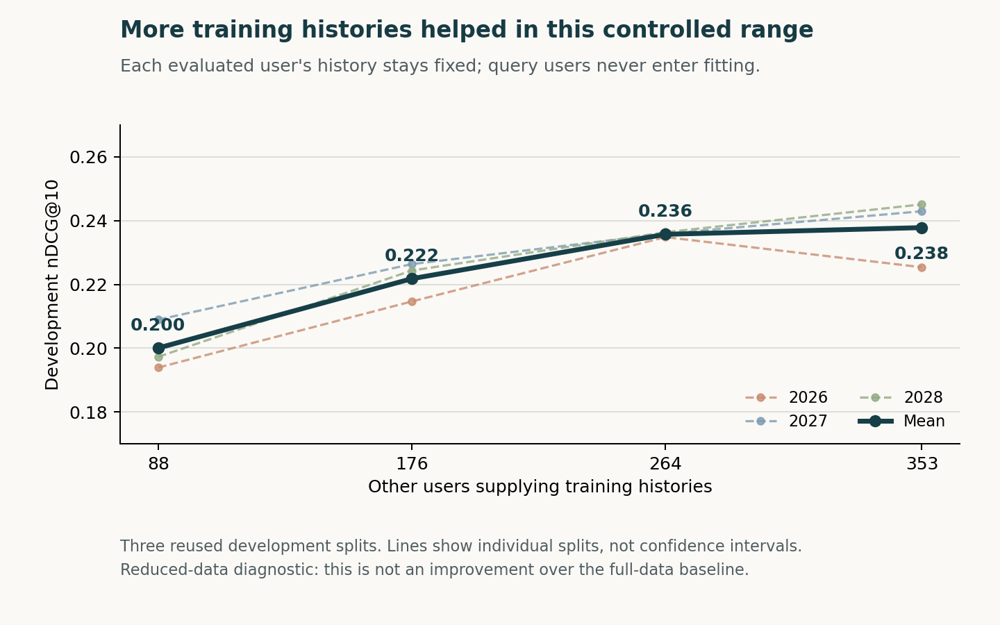

# Diagnosis of the completed exploratory study

These tools preserve all earlier models, runs and evidence. The overlap diagnosis
and donor-data study use the categorical reconstruction study's sealed TRAIN
categories, original cohorts, validation pair identities and selected predictions.
They do not open TEST splits or raw rating files. The separate comparability
analysis reads previously published TEST aggregates to explain differences between
evaluation protocols; it does not evaluate new models on TEST. All new model
outcomes use the already reused development cohort and remain exploratory.

Read [NEXT_RESEARCH.md](NEXT_RESEARCH.md) for the resulting research direction,
`INTERPRETATION.md` for the measured overlap/error conclusions,
`results-v1/RESULTS.md` for the comparison tables, and
`donor-curve-v1/RESULTS.md` for the separately predeclared donor-data sensitivity.
`TAIL_SUPPORT.md` and `tail-support-v1.json` provide the independent item-support
breakdown. [COMPARABILITY.md](COMPARABILITY.md) separates earlier report scores
from these development results; [RESEARCH.md](RESEARCH.md) checks published
benchmarks against their actual protocols.



The figure is generated from the sealed aggregate file with
`python3 exploratory/research_diagnosis/plot_data_scaling.py` using Matplotlib.
It shows a measured data-volume effect within a reduced-data experiment, not a
new model beating the full-data baseline.

The existing personal project runtime is `runs/environment-check/.venv/bin/python`. No install or network access is required. From the final-project root, the focused numerical and boundary checks are:

```sh
OMP_NUM_THREADS=1 OPENBLAS_NUM_THREADS=1 MKL_NUM_THREADS=1 VECLIB_MAXIMUM_THREADS=1 NUMEXPR_NUM_THREADS=1 runs/environment-check/.venv/bin/python -m unittest exploratory.research_diagnosis.test_diagnostics exploratory.research_diagnosis.test_data_scaling -v
```

To reproduce the read-only diagnosis into a fresh directory:

```sh
runs/environment-check/.venv/bin/python exploratory/research_diagnosis/diagnostics.py --research runs/categorical-reconstruction-v1 --out exploratory/research_diagnosis/results-reproduction
```

To reproduce the separately declared 108-fit donor study, with its 12 selected-model refits and serialization checks:

```sh
runs/environment-check/.venv/bin/python exploratory/research_diagnosis/data_scaling.py --source runs/categorical-reconstruction-v1 --out runs/donor-data-scaling-reproduction --evidence exploratory/research_diagnosis/donor-curve-reproduction
```

Both scripts set numerical thread limits before importing NumPy. They refuse existing output directories and verify the older study's source, runtime and payload seals. The diagnosis took 6.53 seconds in the verified environment; the complete donor study took 13.25 seconds. These are recorded elapsed times for this machine, not performance guarantees.

The donor protocol is `PROTOCOL_DATA_SCALING.md`. Only the original meta-fit users can supply donor rows or inner selection queries; every development user is excluded from fitting. The runner seals all twelve selected configurations across three seeds before opening the development evaluation stage. Full local scores, model checkpoints and user cohort IDs are stored only under the ignored `runs/` output. The shareable `donor-curve-v1/` directory contains aggregates, the protocol, hash-only provenance and interpretation, with no individual records.

For another model family, reuse the ordered TRAIN/catalog/cohort inputs and pure metrics, but create a new protocol, runner and selection seal. Neither modifying old results nor silently broadening these grids is part of reproduction.
