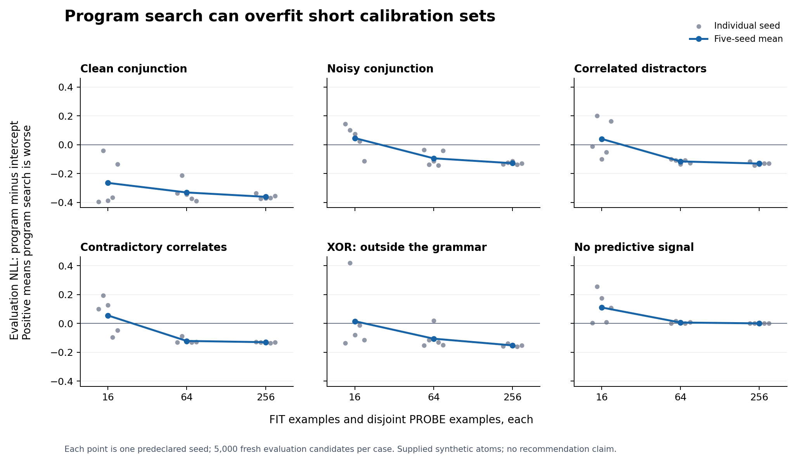

# When personal structure search overfits

The 90-case stress test exposes a limit: selecting a program can overfit short calibration histories, including when no useful signal exists. This argues that personal structure must earn its complexity; it does not establish that population training or a different vocabulary fixes the problem.

- With 16 FIT and 16 separate PROBE examples, the no-signal task yields mean evaluation NLL **0.8073** for beam search versus **0.6968** for the intercept. Beam search is worse in all five seeds, and its evaluation NLL exceeds its PROBE NLL by **0.1839** on average.
- Noisy conjunction also loses to the intercept at 16 examples each (**0.6719 versus 0.6259**), then improves at 256 (**0.4642 versus 0.5923**). These are different predeclared samples at each size, not nested histories.
- Guided search does not always beat an equal-count random grammar pool. With correlated distractors at 16 examples, random search scores **0.5987** versus beam **0.6401**.
- Clean conjunction remains recoverable with enough supplied evidence; mean beam NLL falls from **0.3513** to **0.2321** as calibration size rises. XOR remains outside the useful grammar: at 256 examples, beam NLL is **0.5428** versus **0.2662** for signed linear/pair features.

The figure shows program-minus-intercept NLL. Positive values mean program search is worse; gray points are individual seeds, and the blue line is their mean. This is a diagnostic over five synthetic repeats, not a significance claim. [PDF figure](stress_nll_difference.pdf).

[Prospective protocol and technical amendment](PROTOCOL.md), [all 90 cases with all six methods](all-results.json), [aggregates retaining every seed](aggregates.json), [exact replay of the first 77 cases](prefix-replay.json), and [numerical fallback record](numerical-fallbacks.json).

## Complete predeclared comparison

All 90 predeclared cases completed. Values below are evaluation NLL means over five seeds; lower is better.
No novelty or recommender-quality claim follows from these synthetic tasks.

| Task | FIT / PROBE each | Beam | Random grammar | Selected unary | Signed linear/pairs | Intercept | Beam eval minus probe |
|---|---:|---:|---:|---:|---:|---:|---:|
| clean_conjunction | 16 | 0.3513 | 0.4476 | 0.5604 | 0.5434 | 0.6157 | +0.0671 |
| clean_conjunction | 64 | 0.2694 | 0.3982 | 0.4777 | 0.3909 | 0.6002 | +0.0141 |
| clean_conjunction | 256 | 0.2321 | 0.3082 | 0.4579 | 0.2656 | 0.5930 | -0.0010 |
| noisy_conjunction | 16 | 0.6719 | 0.6701 | 0.6607 | 1.0973 | 0.6259 | +0.0343 |
| noisy_conjunction | 64 | 0.5066 | 0.4971 | 0.5476 | 0.9226 | 0.6008 | -0.0280 |
| noisy_conjunction | 256 | 0.4642 | 0.4797 | 0.5341 | 0.5205 | 0.5923 | +0.0124 |
| correlated_distractors | 16 | 0.6401 | 0.5987 | 0.6608 | 1.1627 | 0.5999 | +0.1704 |
| correlated_distractors | 64 | 0.4986 | 0.4858 | 0.5775 | 0.7601 | 0.6141 | +0.0945 |
| correlated_distractors | 256 | 0.4677 | 0.4791 | 0.5383 | 0.5061 | 0.5984 | -0.0069 |
| contradictory_correlates | 16 | 0.6641 | 0.6985 | 0.6832 | 1.0219 | 0.6087 | +0.3074 |
| contradictory_correlates | 64 | 0.4782 | 0.5220 | 0.5591 | 0.7258 | 0.5997 | +0.0212 |
| contradictory_correlates | 256 | 0.4606 | 0.4832 | 0.5318 | 0.4932 | 0.5906 | -0.0077 |
| xor_misspecified | 16 | 0.7476 | 0.6562 | 0.7395 | 1.3339 | 0.7323 | +0.2383 |
| xor_misspecified | 64 | 0.5972 | 0.5704 | 0.7088 | 0.4692 | 0.7029 | +0.0469 |
| xor_misspecified | 256 | 0.5428 | 0.5811 | 0.6956 | 0.2662 | 0.6948 | -0.0138 |
| no_signal | 16 | 0.8073 | 0.8619 | 0.6981 | 1.6628 | 0.6968 | +0.1839 |
| no_signal | 64 | 0.7070 | 0.7070 | 0.7042 | 1.3580 | 0.7008 | +0.0061 |
| no_signal | 256 | 0.6941 | 0.6937 | 0.6941 | 0.7670 | 0.6937 | +0.0030 |

The complete JSON retains every task, size, seed, reference, selected expression, pool size, runtime and failure. The fixed a5 control is retained there; it is weaker than selecting the best unary atom.

Random and beam searches calibrate exactly the same number of unique syntax candidates per case, then use the same PROBE objective. Their size, depth, and functional priors differ, so a beam advantage would not isolate adaptive reasoning. The signed linear/pair reference has different coefficient capacity and ridge, so small NLL differences do not establish controlled superiority.

These are supplied synthetic atoms with fully observed binary outcomes. Four witness identities remain fixed; 16/64/256 denotes calibration sample count. Correlated proxies carry no additional target information conditional on the observed signal atoms. Neither a real atom learner nor a recommendation loss is tested.

Technical repair: 77 prior completed cases replayed exactly; the identical-objective fallback was used in 1 case. The incomplete first execution and its sources remain preserved. See protocol amendment, prefix-replay.json and numerical-fallbacks.json.
